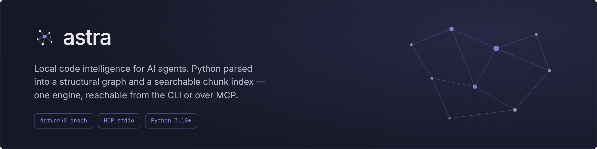
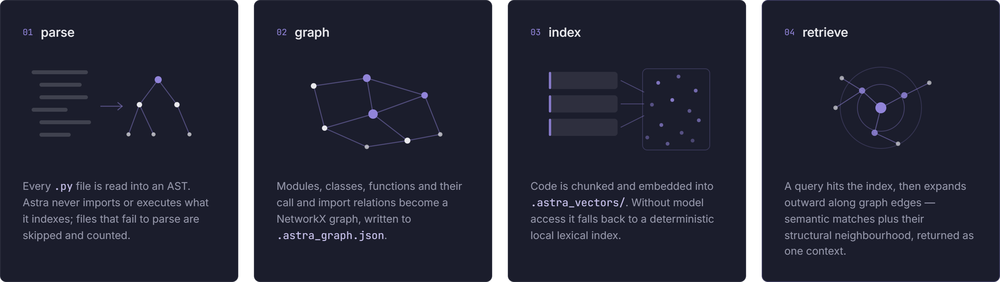
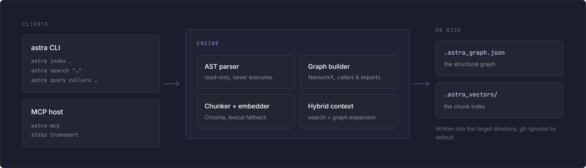
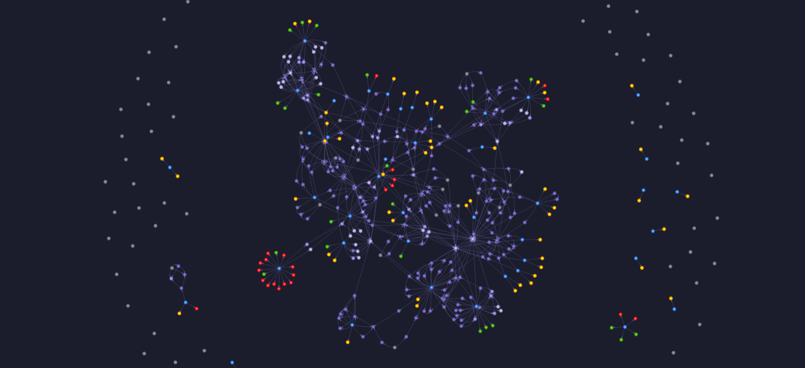
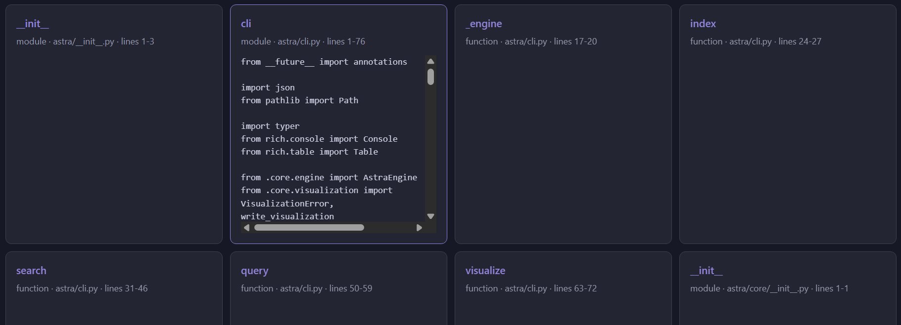
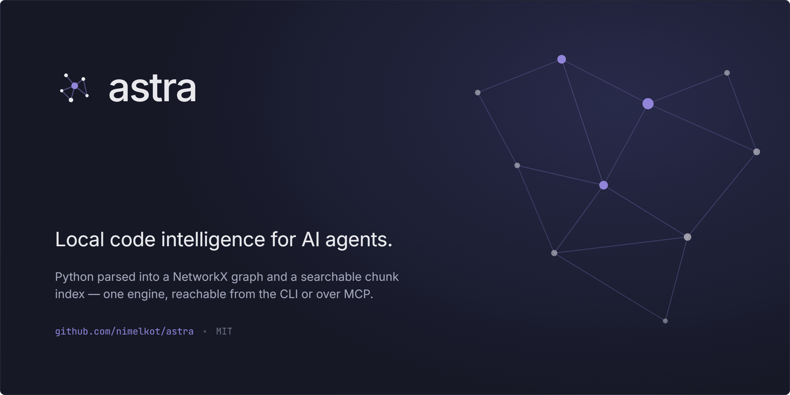

<p align="center">
	
</p>

Astra is a local code intelligence service for AI agents. It parses repository files into a structural NetworkX graph and a searchable local code-chunk index, with full Python AST analysis and AST-compatible structural extraction across common source, markup, and configuration formats. The same engine is available through the `astra` CLI and the official MCP Python SDK.

## Architecture

The constellation mark represents the relationships Astra discovers across a codebase. Its pipeline has four stages: discover files without executing them, build the structural graph, index code chunks, and retrieve semantic matches with graph expansion.

| Component | Role | Output |
| --- | --- | --- |
| AST and text parser | Uses Python AST for `.py` files and language-aware structural extraction for common source, markup, and data formats; indexes other readable files as file-level chunks. | Code chunks and references |
| Structural graph | Builds directed NetworkX relationships between modules, declarations, and callers. | `.astra_graph.json` |
| Vector index | Stores searchable chunks locally, with optional Sentence Transformers and Chroma acceleration. | `.astra_vectors/` |
| Dual interfaces | Makes the same engine available to terminal users and MCP hosts. | `astra` and `astra-mcp` |

The MCP surface exposes eleven tools: `astra_index_repo`, `astra_semantic_search`, `astra_get_callers`, `astra_path`, `astra_dipper`, `astra_tether`, `astra_get_fragility_hotspots`, `astra_impact`, `astra_refactor_plan`, `astra_hybrid_context`, and `astra_visualize`.

<p align="center">
	
</p>

<p align="center"><em>Indexing pipeline</em></p>

<p align="center">
	
</p>

<p align="center"><em>Component map</em></p>

## Install

Python 3.10+ is required. Choose one of these installation paths.

### Install directly from GitHub

This is the simplest option for using Astra. It installs the `astra` and `astra-mcp` commands without placing a checkout in your current folder:

```powershell
python -m pip install "git+https://github.com/nimelkot/astra.git"
```

To upgrade an existing installation to the latest GitHub version:

```powershell
python -m pip install --upgrade --force-reinstall "git+https://github.com/nimelkot/astra.git"
```

For an isolated command-line installation, use `pipx`:

```powershell
pipx install "git+https://github.com/nimelkot/astra.git"
```

### Clone for development

Use this option when you want to edit Astra or run its tests. Run the editable install from the cloned repository root, the directory containing `pyproject.toml`:

```powershell
git clone https://github.com/nimelkot/astra.git
cd astra
Get-ChildItem pyproject.toml
python -m venv .venv
.venv\Scripts\Activate.ps1
python -m pip install -e ".[dev]"
```

If `Get-ChildItem pyproject.toml` cannot find the file, you are not in the Astra repository root yet. The folder you want to analyze can be anywhere; it does not need to be inside the Astra checkout.

## Quick start

Index a project first. Replace the example path with the folder you want Astra to analyze:

```powershell
astra index C:\Users\YourName\Downloads\my-project
```

The command recursively scans nested folders for files without importing or executing them. Valid Python files receive AST-level declarations and call relationships. Common source file types (`.js`, `.jsx`, `.ts`, `.tsx`, `.go`, `.java`, `.cs`, `.c`, `.cc`, `.cpp`, `.h`, `.hpp`, `.rs`, `.php`, `.swift`, `.kt`, `.kts`, `.rb`, `.dart`, `.scala`, `.pl`, `.r`, `.m`, `.lua`, `.vb`, `.vbs`, `.bas`, `.ps1`, `.sh`, `.bash`, `.zsh`, `.bat`, `.cmd`, `.proto`, `.graphql`, `.gql`) receive structural declaration and call extraction into the same graph format. SQL files (`.sql`) receive table/view/function/procedure/trigger extraction and dependency links from statements such as `FROM` and `JOIN`. Markdown (`.md`, `.markdown`, `.mdx`) gets section-level extraction, HTML/XML gets element-level extraction, JSON/JSONC and YAML/TOML/INI-style configs get key-level extraction, and BSON files are handled safely with optional key extraction when a BSON decoder is available. Other readable files remain searchable as file-level chunks. Binary files, unsupported encodings, files larger than 2 MB, and generated or dependency directories such as `.git`, `.venv`, `node_modules`, and `.astra_vectors` are skipped.

For a complete support matrix, see [docs/supported-file-types.md](docs/supported-file-types.md).

```text
my-project/
├── .astra_graph.json   # structural modules, declarations, and call relationships
└── .astra_vectors/     # local searchable code chunks
```

Run `astra index` again after the source code changes. Indexing replaces the previous graph and chunk index for that target directory.

Astra uses a lightweight hash cache (`.astra_index_cache.json`) so repeated indexing only reparses files whose contents changed. Unchanged files reuse cached structural chunks and references.

## CLI

### Semantic search

Search by a concept, behavior, symbol name, or docstring text:

```powershell
astra search "authentication token validation" --path C:\Users\YourName\Downloads\my-project --limit 8
```

The result table shows the match score, declaration kind, file path, symbol, and source lines. Search results are empty when no indexed chunk shares terms with the query.

### Structural callers

Find functions that call a target function:

```powershell
astra query callers calculate_total --path C:\Users\YourName\Downloads\my-project
```

The `callers` query uses the saved AST graph and reports matching caller nodes as JSON. The current CLI structural query type is `callers`.

### Structural shortest path

Find the shortest relationship path between two symbols:

```powershell
astra path "FastAPI" "ModelField" --path C:\Users\YourName\Downloads\my-project
```

Example output:

```text
FastAPI
fastapi/applications.py:65
↳ DefaultPlaceholder
fastapi/dependencies/models.py:21
↳ get_request_handler()
fastapi/routing.py:310
↳ ModelField
pydantic/fields.py:740

Shortest path (3 hops):
  FastAPI --uses--> DefaultPlaceholder <--references-- get_request_handler() --references--> ModelField
```

<p align="center">
	
</p>

### Dipper sub-graph scoop

Extract a token-optimized, dependency-complete local sub-graph around a concept or symbol:

```powershell
astra dipper "checkout flow" --path C:\Users\YourName\Downloads\my-project --limit 6 --parent-depth 1 --child-depth 1
```

The command returns JSON with seeds, nodes, edges, and trimmed source snippets for direct LLM prompting.

### Tether structural health sentinel

Run graph-health checks to flag architectural drift risks:

```powershell
astra tether --path C:\Users\YourName\Downloads\my-project --cycle-limit 25 --fanout-threshold 12
```

The report includes cycles, orphan declarations, high fan-out symbols, anomaly summaries, and a pass/warn status.

### Fragility hotspots

Rank functions and classes by graph centrality, AST complexity, and architectural instability:

```powershell
astra fragility --path C:\Users\YourName\Downloads\my-project --limit 10 --threshold 75
```

The matching MCP tool is `astra_get_fragility_hotspots`. See [docs/fragility-hotspots.md](docs/fragility-hotspots.md) for the scoring formula and LLM/CI workflows.

### Impact and refactor planning

Inspect the upstream blast radius of a declaration:

```powershell
astra impact calculate_total --path C:\Users\YourName\Downloads\my-project
```

Preview a graph-ordered identifier rename without changing files:

```powershell
astra refactor-plan calculate_total sum_total --path C:\Users\YourName\Downloads\my-project
```

The MCP equivalents are `astra_impact` and `astra_refactor_plan`. `astra tether` continues to report orphan declarations and circular dependencies, while `astra visualize` provides the structural anomaly view. See [docs/fragility-hotspots.md](docs/fragility-hotspots.md) for the full CLI/MCP workflow.

### Tether CI gate policy

Recommended policy for pull-request automation:

- **Fail** when new structural cycles are introduced.
- **Warn** when orphan-node count or high-fanout count increases beyond your baseline.
- **Pass** when cycles do not increase and coupling metrics stay within threshold.

A practical CI sequence:

1. Index the repository snapshot for the PR branch.
2. Run `astra tether` and store the JSON output.
3. Compare `summary.cycles`, `summary.orphans`, and `summary.high_fanout` against your `main` baseline.
4. Block merge only for hard-fail conditions (for example, cycle growth).
5. Post warn-level findings as automated PR comments.

Example command:

```powershell
astra index C:\Users\YourName\Downloads\my-project
astra tether --path C:\Users\YourName\Downloads\my-project --cycle-limit 25 --fanout-threshold 12
```

### Search behavior

The default index is deterministic and works offline using local lexical matching. To enable Sentence Transformers and Chroma vector retrieval, set this before indexing and searching:

```powershell
$env:ASTRA_ENABLE_EMBEDDINGS = "1"
astra index C:\Users\YourName\Downloads\my-project
astra search "rate limiting and retries" --path C:\Users\YourName\Downloads\my-project
```

The first embedding-enabled run may download the `all-MiniLM-L6-v2` model. If model access or the vector store is unavailable, Astra falls back to the local search implementation.

### Visualize an index

After indexing, generate a local HTML report for the target folder:

```powershell
astra visualize C:\Users\YourName\Downloads\my-project
```

This writes `.astra_visualization.html` into the target folder. Open that file in a browser to inspect two views:

- **Structural graph**: interactive modules, classes, functions, methods, and definition/call edges from `.astra_graph.json`.
- **Vector chunks**: searchable file and symbol cards from `.astra_vectors/chunks.json`, with expandable source previews.

You can choose a different output path:

```powershell
astra visualize C:\Users\YourName\Downloads\my-project --output C:\Users\YourName\Desktop\astra-report.html
```

The report uses the Vis Network browser library from its CDN for the structural canvas. The vector view and generated data remain local; an internet connection is only needed to load the interactive graph library when opening the report.

### Visualization examples

The structural graph view renders connected modules, declarations, and relationships across the indexed project:

<p align="center">
	
</p>

The vector chunks view provides searchable cards with file paths, symbols, line ranges, and expandable source previews:

<p align="center">
	
</p>

## MCP

Astra also exposes its engine as an official MCP server over stdio. Configure your MCP host to run `astra-mcp`; the server must be installed in the environment used by that host.

The native tools are:

| Tool | Purpose |
| --- | --- |
| `astra_index_repo(path)` | Index a local repository. |
| `astra_semantic_search(path, query, limit)` | Search indexed code chunks. |
| `astra_get_callers(path, target, limit)` | Find callers through the structural graph. |
| `astra_path(path, source, target, max_hops)` | Find the shortest structural path between two symbols. |
| `astra_dipper(path, query, limit, parent_depth, child_depth, max_nodes, max_source_chars)` | Scoop a localized dependency-complete sub-graph for token-efficient LLM context. |
| `astra_tether(path, cycle_limit, fanout_threshold)` | Run structural health checks and return architecture anomaly findings. |
| `astra_get_fragility_hotspots(path, limit, threshold)` | Rank fragile declarations using graph centrality, AST complexity, and instability. |
| `astra_impact(path, target, max_nodes)` | Trace incoming calls and dependencies to report a declaration's blast radius. |
| `astra_refactor_plan(path, target, replacement)` | Preview a graph-ordered, read-only structural identifier rename. |
| `astra_hybrid_context(path, query, limit, expansion)` | Combine semantic matches with graph expansion. |
| `astra_visualize(path, output)` | Generate a local HTML graph report and return its file path and URL. |

The repository includes [.vscode/mcp.json](.vscode/mcp.json) for VS Code MCP clients. For other hosts, register the server in the host's configuration:

```toml
[mcp_servers.astra]
command = "astra-mcp"
args = []
```

If the host cannot find commands from your shell, use the absolute executable path: `.venv\Scripts\astra-mcp.exe` on Windows or `.venv/bin/astra-mcp` on macOS/Linux. The server communicates over stdio, so do not redirect its stdout.

## Integrations

### Claude Desktop

Use the server over stdio (`astra-mcp`) and call tools like `astra_dipper` and `astra_tether` from Claude. A complete setup guide is available in [docs/claude-desktop.md](docs/claude-desktop.md).

### Claude CLI

Register Astra with Claude Code from your terminal:

```powershell
claude mcp add --transport stdio astra -- astra-mcp
```

Verify the server with `claude mcp list`, then start Claude Code and ask it to use Astra's MCP tools. If `astra-mcp` is not on your `PATH`, replace it with the absolute path to `.venv\Scripts\astra-mcp.exe` on Windows or `.venv/bin/astra-mcp` on macOS/Linux.

### Gemini CLI

Gemini can consume Astra through any MCP-compatible bridge or local tool host that supports stdio MCP servers. Register `astra-mcp`, then use `astra_dipper` to scoop focused context and `astra_tether` for PR health checks.

Register Astra with Gemini CLI:

```powershell
gemini mcp add astra astra-mcp
```

Verify the server with `gemini mcp list`, then start Gemini CLI and ask it to index or search your project with Astra. If `astra-mcp` is not on your `PATH`, use the absolute executable path as the command instead.

### Codex CLI

Codex CLI can run Astra directly from terminal commands:

```powershell
astra index C:\Users\YourName\Downloads\my-project
astra dipper "payment retry flow" --path C:\Users\YourName\Downloads\my-project
astra tether --path C:\Users\YourName\Downloads\my-project
```

For MCP-based Codex workflows, point your MCP client config to `astra-mcp` and invoke `astra_path`, `astra_dipper`, and `astra_tether` as needed.

## Development

```bash
pytest
ruff check .
```

Astra never imports or executes files it indexes. Parsing failures are skipped and reported only through the resulting counts, which keeps indexing useful for partially broken working trees.

<p align="center">
	
</p>
